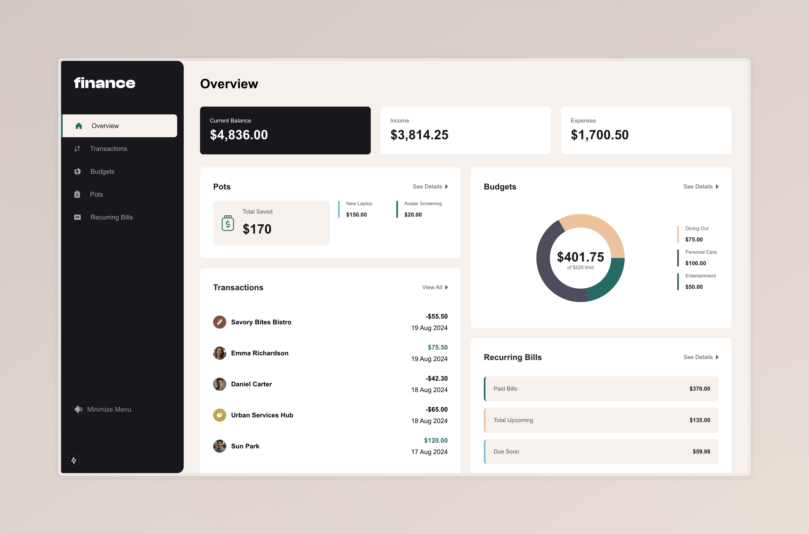

# Frontend Mentor - Personal finance app solution

This is a solution to the [Personal finance app challenge on Frontend Mentor](https://www.frontendmentor.io/challenges/personal-finance-app-JfjtZgyMt1). Frontend Mentor challenges help you improve your coding skills by building realistic projects.

## Table of contents

- [Overview](#overview)
  - [The challenge](#the-challenge)
  - [Screenshot](#screenshot)
  - [Links](#links)
- [My process](#my-process)
  - [Built with](#built-with)
  - [What I learned](#what-i-learned)
  - [Continued development](#continued-development)
  - [Useful resources](#useful-resources)
- [Author](#author)
- [Acknowledgments](#acknowledgments)

## Overview

### The challenge

Users should be able to:

- See all of the personal finance app data at-a-glance on the overview page
- View all transactions on the transactions page with pagination for every ten transactions
- Search, sort, and filter transactions
- Create, read, update, delete (CRUD) budgets and saving pots
- View the latest three transactions for each budget category created
- View progress towards each pot
- Add money to and withdraw money from pots
- View recurring bills and the status of each for the current month
- Search and sort recurring bills
- Receive validation messages if required form fields aren't completed
- Navigate the whole app and perform all actions using only their keyboard
- View the optimal layout for the interface depending on their device's screen size
- See hover and focus states for all interactive elements on the page
- **Bonus**: Save details to a database (build the project as a full-stack app)
- **Bonus**: Create an account and log in (add user authentication to the full-stack app)

Note: At the time of writing, I didn't implement the bonus features. However, I plan to add them when I add the database and authentication features.
### Screenshot

### Links

- Solution URL: [GitHub Repository](https://github.com/tesla-ambassador/Personal-finance-app)
- Live Site URL: [Add live site URL here](https://your-live-site-url.com)

## My process
Buckle up! This was a very fun project to work on. I had lots of ups and downs but I learned a lot! I feel like I only want to take on more challenging projects like this moving forward.
If you look through my code, you will find that it's both poorly written and well-written.😂 There were times I was just too tired after working my day job and then trying to fix bugs that seemed impossible to find.
Anyways, I managed to get this done within a month. That's cause I had to split my time between work and this project. I haven't yet implemented a backend but I plan on doing so after taking on a few more projects like this to cement what I've learned.

### Built with

- Next.js
- Tailwind CSS
- Shadcn/ui
- Recharts
- Vitest
- [Zustand](https://zustand.docs.pmnd.rs/) - React library for state management
- [React-hook-form](https://react-hook-form.com/) - React library for form validation
- [Tanstack Table](https://tanstack.com/table/latest) - React library for data tables and datagrids

### What I learned
I learned a bunch of things. I should have documented this while I was developing the app because I seem to have forgotten most of my highlights but among the most notable ones are that I learned how to use Tanstack Table to create a data grid.
That was mostly for the transactions page and the recurring bills page. It was a bit of a pain to implement some of the functions but I had to repeat writing the code multiple times until it stuck.
I also had a little more time with react-hook-form. I feel like I'm a lot more comfortable with it now and I'm looking forward to using it in more projects.
I learned how to use Clsx and a lot more capabilities of Tailwind Css.
News Flash! Did you know that `next/router` is deprecated! Funny how these frameworks are always changing.

I would also like to express my deep sadness for the deprecation of Material Themes in VS Code. I couldn't find a replacement to get themes that I'd be comfortable with and therefore, I have migrated to Zed.
Zed is great! I'm trying to get comfortable with it but I know It'll do just fine! I look forward to giving you guys a review of it.

Much as I would love to rant, I'm tired rn... I haven't slept in a bit so I'll just wrap this up and write more when I implement a backend!
**Note: Delete this note and the content within this section and replace with your own learnings.**

### Continued development
I'm going to add authentication and connect to a database so that It's a lot more usable and also when you refresh, my zustand persistence is a bit shaky in that you are able to see the default data for a second or two.
I noticed a lot of bugs and I tried to fix the ones that I found. If you find any, please feel free to fork the project and submit a pull request.

### Useful resources

Read documentations of the tools I stated above
Also, you can use AI (Claude) to help explain things to you (NOT to copy and paste code). Cause I found the solutions on stack-overflow either too old or just not directly applicable to my problem.

## Author

- Website - [tesla-ambassador](http://portfolio-pink-ten-21.vercel.app)
- Frontend Mentor - [@tesla-ambassador](https://www.frontendmentor.io/profile/tesla-ambassador)
- Twitter - [@Mbawalla_](https://x.com/Mbawalla_)

## Acknowledgments

I'd like to thank my mama for her internet (Please employ me if you're reading this... I need to move out 😭). I'd also like to thank my girlfriend Comfort, for her patience and understanding. I'd also like to thank my friends, Josh, Ezra and Yafet for their support and encouragement.
Okay, I'm done... Someone tell Elon Musk I said thank you to him.
